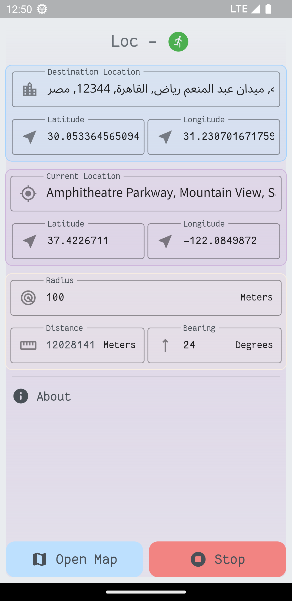
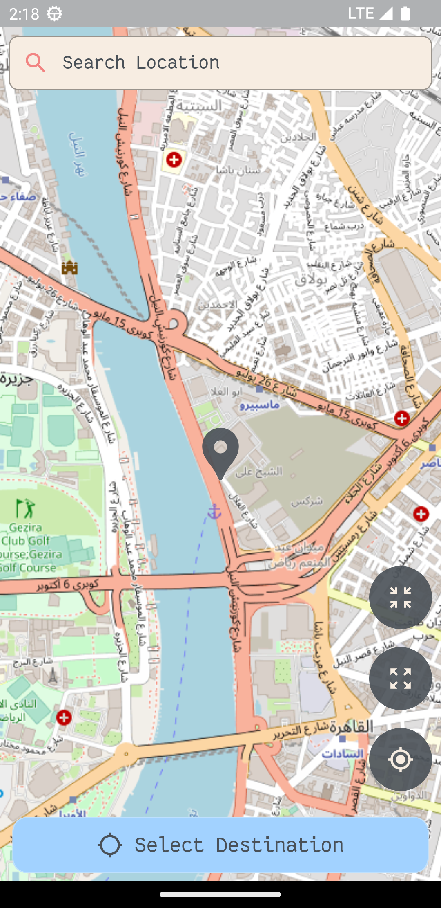
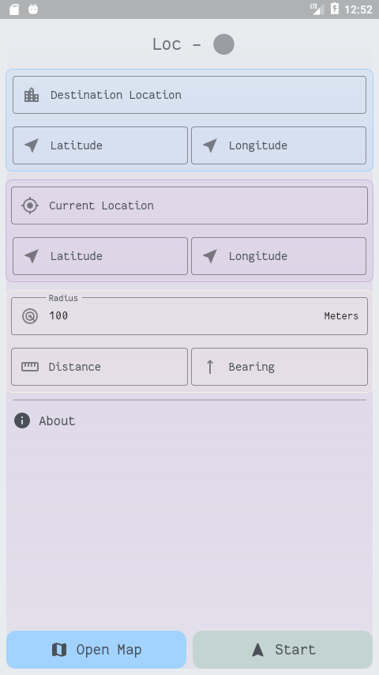

<div align="center">
  </img>
</div>

<h1 align="center">Loc</h1>
<h3 align="center">Free and open-source location-based reminder for Android.</h3>


## Features

- Free and open-data embedded map (based on OSM).
- Search for the destination.
- Shows Eucliedian distance and bearing angle.
- Shows Live location.
- Customizable radius of a circle around the destination.
- Remind you with sound when you arrive.
- Offline/Online usage.
- Displays location name.

## Download

[](https://apt.izzysoft.de/fdroid/index/apk/org.abdeltwabmf.loc)

Or get the latest APK from the [Releases Section](https://github.com/AbdeltwabMF/Loc/releases/latest).

## Screenshots





## Development

### Tools required

- [Flutter SDK](https://docs.flutter.dev/get-started/install/windows)
- [Android studio](https://developer.android.com/studio). Follow the instructions [here](https://docs.flutter.dev/get-started/install/windows#android-setup) to get it work on windows.
- VS Code (Optional). You need to install [Flutter plugin](https://marketplace.visualstudio.com/items?itemName=Dart-Code.flutter)

### Build

1. Clone the repository.

```shell
git clone https://github.com/AbdeltwabMF/Loc.git
cd Loc
```

2. Generate the mobile specific files and download dependencies.

```shell
flutter create --platforms=ios,android .
flutter pub get
```

3. Open `main.dart` and start from there and then click on the top-right play button to `RUN` the app.

```shell
cd lib
```

## Release

```shell
flutter build apk --build-name=<vx.y.x> --release
```

## License

Licensed under the [GPL-v3](LICENSE) License.
