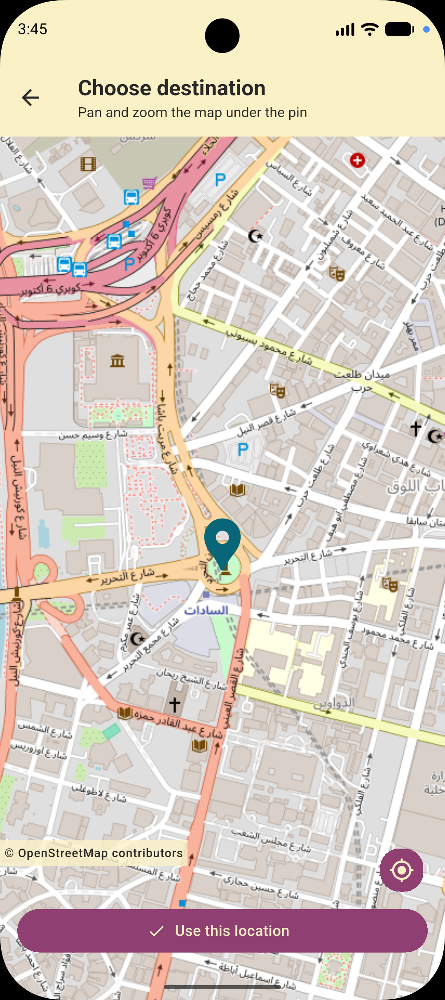
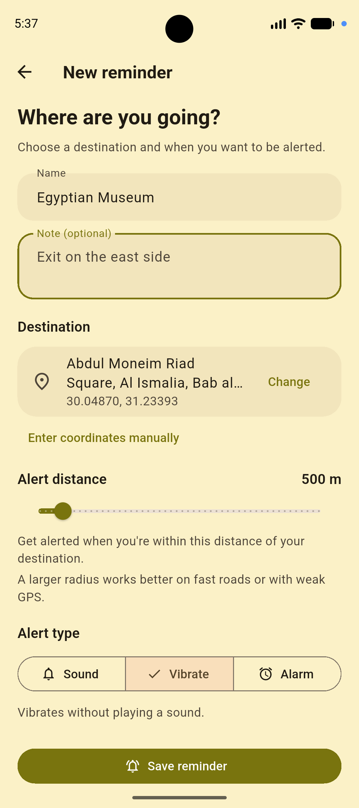
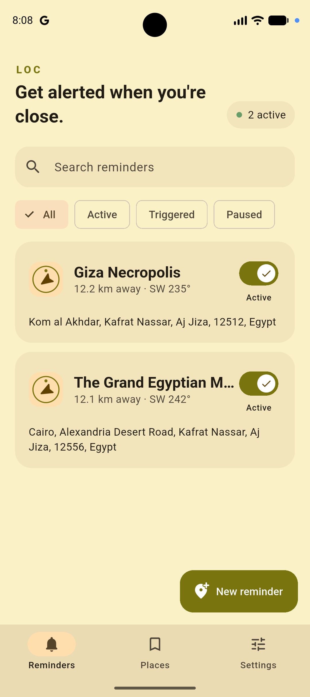

<div align="center">
  
</div>

<h1 align="center">
  Loc
</h1>

<h4 align="center">
  The location-based reminder for Android. Set a destination. Get notified as you get nearby.
</h4>

<div align="center">
  <a href="https://github.com/AbdeltwabMF/loc/releases">
    
  </a>

  <a href="https://apps.obtainium.imranr.dev/redirect?r=obtainium://add/https://github.com/AbdeltwabMF/loc">
    
  </a>
</div>

## Preview

<p align="center">
  
  &nbsp;
  
  &nbsp;
  
</p>

## Features

- **Multiple Location Reminders:** Set and manage reminders for different places independently.
- **Smart Background Tracking:** Detect arrivals even with the screen off or at high speeds.
- **Flexible Arrival Alerts:** Choose an alert type and adjust the arrival distances.
- **Easy Location Selection:** Pick locations using maps, shared locations, or GPS coordinates.

## Development

Install [Flutter](https://docs.flutter.dev/get-started/install) and Android SDK
Platform 36, then run:

```shell
flutter doctor -v
flutter pub get
flutter analyze
flutter test
flutter run
```

Ensure the code is formated using:

```shell
dart format lib test
```

## Build

**Debug build**
```shell
flutter build apk --debug
```

**Release build**
```shell
flutter build apk --release --split-per-abi --obfuscate --split-debug-info=build/debug-info
```

## License

Loc is licensed under the [GNU General Public License v3.0](LICENSE).
