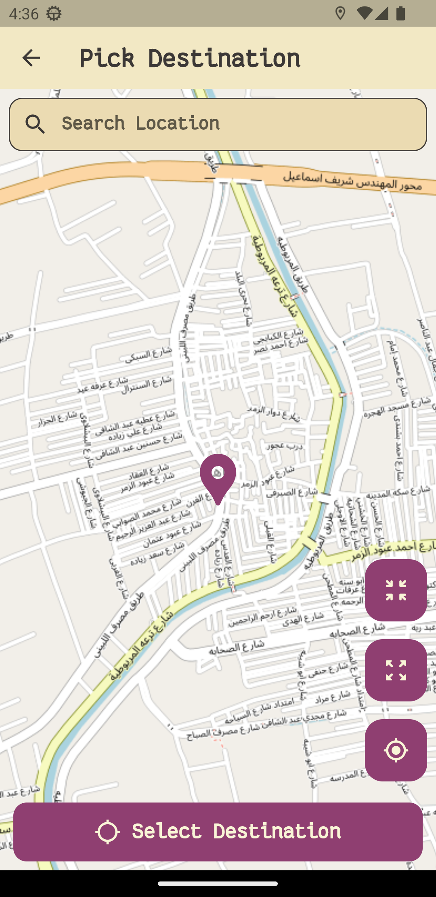

<div align="center">
  </img>
</div>

<h1 align="center">Loc</h1>
<h3 align="center">Free and open-source location-based reminder for Android.</h3>


<p align='center'>
</p>

<p align='center'>
  
  
  
</p>

## ✨ Features

- Based on the free and open-data Open Street Map.
- Support multiple reminders.
- Support title and notes for the reminder.
- Disable/Enable specific reminders.
- Delete/Edit/Search reminders.
- Save favorite places for later usage.
- Dark/Light theme.
- Run in background.
- Offline usage.
- Online usage (Map navigation).
- Live location.
- Search for the destination.
- Shows Eucliedian distance between current and destination locations.
- Compass for bearing angle. (not yet)
- Customizable radius of a circle around the destination.
- Remind with sound when arriving.

## Development

### Tools required

- [Flutter SDK](https://docs.flutter.dev/get-started/install/windows)
- [Android studio](https://developer.android.com/studio). Follow the instructions [here](https://docs.flutter.dev/get-started/install/windows#android-setup) to get it work on windows.
- VS Code (Optional). You need to install [Flutter plugin](https://marketplace.visualstudio.com/items?itemName=Dart-Code.flutter)

### Build

```shell
git clone https://github.com/AbdeltwabMF/loc.git
cd loc
flutter pub get
```

Open `main.dart` and start from there and then click on the top-right play button to `RUN` the app.

## Release

```shell
flutter build apk --build-name=<vx.y.x> --build-number=<int> --release
```

## License

Licensed under the [GPL-v3](LICENSE) License.
